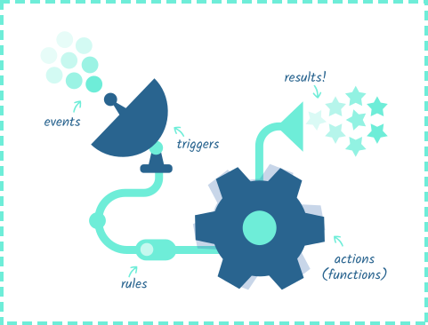

# Introduction to Adobe I/O Runtime

The idea of serverless computing is to abstract the server infrastructure from the developer, so developers can concentrate on application logic, not configuring and deploying servers. With a serverless computing platform like Adobe I/O Runtime, those portions of your application logic that need to be accessible from the Internet, and would normally be executed on a traditionally hosted server or a cloud service such as AWS or Azure, can be hosted on Runtime as on-demand functions and executed as needed via HTTP requests or Adobe I/O Events.

## The programming model
On Adobe I/O Runtime, code is executed on demand in response to Adobe I/O Events or HTTP requests controlled by conditional logic (_rules_). Runtime provides a programming environment supported by a REST API-based command line interface (the _CLI_) and other tools.

  
*The event processing pipeline*

The Runtime programming model makes use of the following entities:

* **Actions:** Functions hosted on Runtime are called actions, executed in response to a trigger. Actions always present a single method signature.

* **Events:** Events are the entities that initiate Runtime processing. Runtime responds to events from Adobe I/O Events or direct HTTP requests.

* **Triggers:** Triggers can be used in conjunction with Rules to invoke one or more actions when called via an HTTP endpoint.

* **Rules:** Rules define the relationship between a trigger and an action, determining what actions are executed in response to the trigger under what conditions.

* **Sequences:** Sequences declare a series of actions so that a single trigger can execute the entire set.

* **Packages:** Packages bundle together a set of associated actions, and optionally feeds, and allow them to be shared with others.
